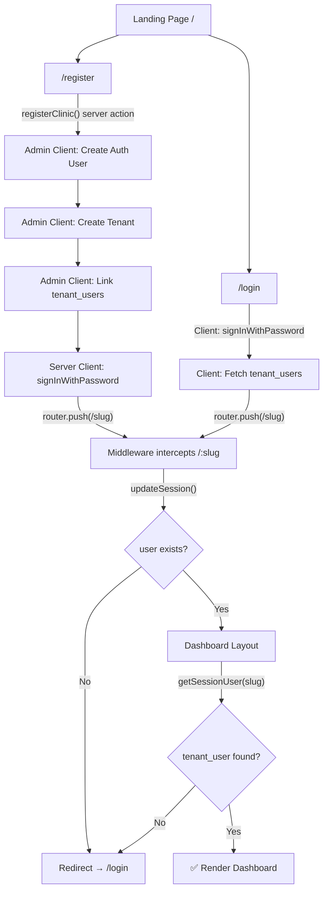
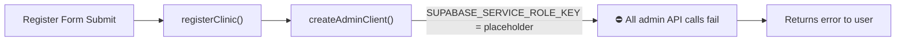
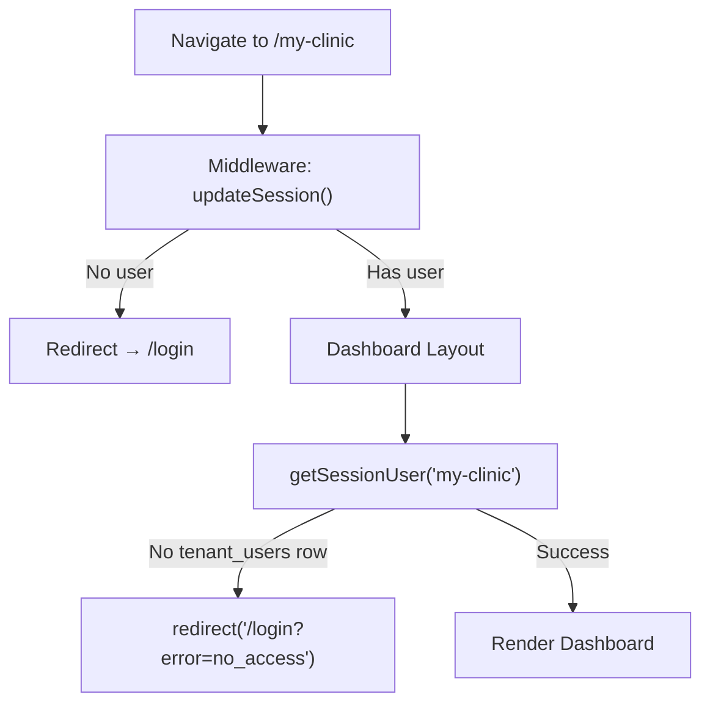

# MedFlow Authentication Flow — Detailed Analysis

## Architecture Overview



---

## 1. Is Supabase Correctly Configured?

### ⚠️ Partially — There Are Config Bugs

#### Environment File ([.env.local](file:///Users/maheskaliraj/Documents/MedFlow/medflow/.env.local))

```env
# Supabase
NEXT_PUBLIC_SUPABASE_URL=http://localhost:54321          # ← LINE 2 (overridden)
NEXT_PUBLIC_SUPABASE_ANON_KEY=your-anon-key-here         # ← LINE 3 (overridden)
SUPABASE_SERVICE_ROLE_KEY=your-service-role-key-here      # ← LINE 4 ⛔ STILL PLACEHOLDER

# App
NEXT_PUBLIC_APP_URL=http://localhost:3000
NEXT_PUBLIC_SUPABASE_URL=https://exdztporvuseyrecepvl.supabase.co    # ← LINE 8 (wins)
NEXT_PUBLIC_SUPABASE_ANON_KEY=sb_publishable_RIocprkunPro2hGu26Nwkg_WziQ04e_  # ← LINE 9 (wins)
```

> [!CAUTION]
> **`SUPABASE_SERVICE_ROLE_KEY` is still the placeholder `your-service-role-key-here`.**
> This means every call to `createAdminClient()` — used by `registerClinic()`, `inviteUser()`, and `getTenantUsers()` — will **silently fail with authentication errors**.

> [!WARNING]
> **`NEXT_PUBLIC_SUPABASE_URL` is declared twice.** Line 8 overwrites Line 2. This works by coincidence (the cloud URL wins), but it's confusing and error-prone. The leftover `localhost:54321` reference suggests this was copied from a local Supabase setup.

#### Supabase Client Setup — ✅ Correct

| File | Pattern | Verdict |
|------|---------|---------|
| [client.ts](file:///Users/maheskaliraj/Documents/MedFlow/medflow/src/lib/supabase/client.ts) | `createBrowserClient()` | ✅ Correct for client components |
| [server.ts](file:///Users/maheskaliraj/Documents/MedFlow/medflow/src/lib/supabase/server.ts) | `createServerClient()` with cookie store | ✅ Correct for server components/actions |
| [middleware.ts](file:///Users/maheskaliraj/Documents/MedFlow/medflow/src/lib/supabase/middleware.ts) | `createServerClient()` with request cookies | ✅ Correct pattern for middleware |
| [admin.ts](file:///Users/maheskaliraj/Documents/MedFlow/medflow/src/lib/supabase/admin.ts) | `createClient()` with service role key | ✅ Correct pattern, but ⛔ key is placeholder |

#### Database Schema — ✅ Well Designed

The [migration SQL](file:///Users/maheskaliraj/Documents/MedFlow/medflow/supabase/migrations/001_create_schema.sql) defines all required tables. [RLS policies](file:///Users/maheskaliraj/Documents/MedFlow/medflow/supabase/migrations/002_create_rls_policies.sql) enforce tenant isolation. **However**, it's unclear if these migrations have actually been applied to the cloud Supabase instance.

---

## 2. Is User Registration Creating Users?

### ⛔ No — Registration Is Broken

The [registerClinic()](file:///Users/maheskaliraj/Documents/MedFlow/medflow/src/lib/auth/actions.ts#L10-L94) server action does 4 steps:

| Step | Code | Uses | Works? |
|------|------|------|--------|
| 1. Check slug uniqueness | `adminClient.from('tenants').select()` | Admin client | ⛔ Fails — bad service key |
| 2. Create auth user | `adminClient.auth.admin.createUser()` | Admin client | ⛔ Fails — bad service key |
| 3. Create tenant row | `adminClient.from('tenants').insert()` | Admin client | ⛔ Fails — bad service key |
| 4. Link user to tenant | `adminClient.from('tenant_users').insert()` | Admin client | ⛔ Fails — bad service key |
| 5. Sign in user | `supabase.auth.signInWithPassword()` | Server client | Never reached |

> [!IMPORTANT]
> **Every step that uses `createAdminClient()` fails because `SUPABASE_SERVICE_ROLE_KEY` is a placeholder string.** The admin client is required because:
> - Step 2 uses `auth.admin.createUser()` which requires admin privileges
> - Steps 1, 3, 4 need to bypass RLS (no user session exists yet during registration)

**What the user sees:** The function returns `{ error: "..." }` from step 2, and the registration form shows an error message.

---

## 3. Is Email Verification Required?

### No — Email Verification Is Explicitly Bypassed

In [registerClinic()](file:///Users/maheskaliraj/Documents/MedFlow/medflow/src/lib/auth/actions.ts#L46-L50):

```typescript
const { data: authData, error: signUpError } = await adminClient.auth.admin.createUser({
  email,
  password,
  email_confirm: true,  // ← Auto-confirms the email
});
```

`email_confirm: true` tells Supabase to mark the email as verified immediately. The user never receives a verification email.

This is a **deliberate design choice** — the admin creates the user with pre-confirmed email, then immediately signs them in. This is valid for a clinic-registration flow where the admin is creating their own account.

> [!NOTE]
> The `inviteUser()` function in [tenant/actions.ts](file:///Users/maheskaliraj/Documents/MedFlow/medflow/src/lib/tenant/actions.ts#L179-L243) also uses `email_confirm: true` when creating invited users. These users get a temporary password but **no email notification** is sent. There's no password-reset or invitation-email flow implemented.

---

## 4. Is Login Successfully Creating a Session?

### ✅ Yes (If User Exists) — The Login Flow Itself Is Correct

The [login page](file:///Users/maheskaliraj/Documents/MedFlow/medflow/src/app/%28auth%29/login/page.tsx) flow:

```
1. User enters email + password
2. Client-side: supabase.auth.signInWithPassword({ email, password })
3. Client-side: supabase.auth.getUser() → get user.id
4. Client-side: SELECT from tenant_users WHERE user_id = ? AND is_active = true
5. If tenant found → router.push(`/${slug}`)
6. If no tenant → show "No active clinic found"
```

The login mechanism is technically correct:
- ✅ Uses `signInWithPassword()` on the browser client (correct for client components)
- ✅ Supabase SSR automatically sets auth cookies
- ✅ The middleware's `updateSession()` correctly refreshes the session on subsequent requests

**But it can't work yet** because no users can be created (see #2 above).

---

## 5. Is Tenant Creation Implemented?

### ✅ Code Exists, But ⛔ Cannot Execute

Tenant creation is implemented inside [registerClinic()](file:///Users/maheskaliraj/Documents/MedFlow/medflow/src/lib/auth/actions.ts#L60-L71):

```typescript
// 2. Create the tenant (bypasses RLS with admin client)
const { data: tenant, error: tenantError } = await adminClient
  .from('tenants')
  .insert({ name: clinicName, slug })
  .select()
  .single();
```

The logic is sound:
- ✅ Generates a URL slug from the clinic name
- ✅ Checks for slug uniqueness before creating
- ✅ Creates the tenant row
- ✅ Links the user as `admin` role in `tenant_users`
- ✅ Has cleanup logic (deletes auth user if tenant creation fails, etc.)

**But it all depends on `createAdminClient()` which has a placeholder key.**

---

## 6. Why Does the Application Stop After Login/Register?

### Root Cause Analysis

There are **three cascading failures**:

#### Failure 1: Registration Never Completes (Blocks Everything)



Since registration can't create users or tenants, there's nothing to log into.

#### Failure 2: Post-Login Redirect Has No Destination (Even If Login Worked)

Even if a user somehow existed in Supabase Auth, the login page queries `tenant_users` to find their tenant slug:

```typescript
// login/page.tsx line 43-49
const { data: tenantUser } = await supabase
  .from('tenant_users')
  .select('tenant:tenants!inner(slug)')
  .eq('user_id', user.id)
  .eq('is_active', true)
  .limit(1)
  .single();
```

If no `tenant_users` row exists (because registration failed to create one), this returns `null`, and the user sees: **"No active clinic found for your account."**

#### Failure 3: Dashboard Guard Redirects Back to Login

Even if the user managed to navigate to `/{slug}`, the [dashboard layout](file:///Users/maheskaliraj/Documents/MedFlow/medflow/src/app/%28dashboard%29/%5BtenantSlug%5D/layout.tsx#L16) calls `getSessionUser(tenantSlug)` which:

1. Checks `supabase.auth.getUser()` — would fail if no session
2. Queries `tenant_users` with the slug — would fail if no data
3. Calls `redirect('/login')` on any failure



---

## Summary of All Issues

| # | Issue | Severity | File | Fix |
|---|-------|----------|------|-----|
| 1 | `SUPABASE_SERVICE_ROLE_KEY` is placeholder | 🔴 **Critical** | [.env.local](file:///Users/maheskaliraj/Documents/MedFlow/medflow/.env.local):4 | Set real service role key from Supabase dashboard |
| 2 | Duplicate `NEXT_PUBLIC_SUPABASE_URL` | 🟡 Minor | [.env.local](file:///Users/maheskaliraj/Documents/MedFlow/medflow/.env.local):2,8 | Remove the localhost:54321 line |
| 3 | Duplicate `NEXT_PUBLIC_SUPABASE_ANON_KEY` | 🟡 Minor | [.env.local](file:///Users/maheskaliraj/Documents/MedFlow/medflow/.env.local):3,9 | Remove the placeholder line |
| 4 | Migrations may not be applied | 🟠 Unknown | [migrations/](file:///Users/maheskaliraj/Documents/MedFlow/medflow/supabase/migrations) | Verify tables exist in Supabase SQL editor |
| 5 | No invitation/password-reset email flow | 🟡 Feature gap | [tenant/actions.ts](file:///Users/maheskaliraj/Documents/MedFlow/medflow/src/lib/tenant/actions.ts#L179-L243) | Implement email sending for invites |
| 6 | `registerClinic` signs in via Server Client | 🟡 Fragile | [auth/actions.ts](file:///Users/maheskaliraj/Documents/MedFlow/medflow/src/lib/auth/actions.ts#L90-L91) | Server action `signInWithPassword` can't set cookies reliably — should redirect and let client sign in |

---

## Recommended Fix Order

1. **Set the real `SUPABASE_SERVICE_ROLE_KEY`** in `.env.local` (get it from Supabase Dashboard → Settings → API → `service_role` key)
2. **Clean up `.env.local`** — remove duplicate entries
3. **Verify migrations are applied** — run the SQL in Supabase SQL editor
4. **Fix the post-registration sign-in**: Instead of calling `signInWithPassword()` in the server action (which can't reliably set browser cookies), return success + credentials and let the client-side handle the sign-in
5. **Test the full flow**: Register → auto sign-in → redirect to dashboard
