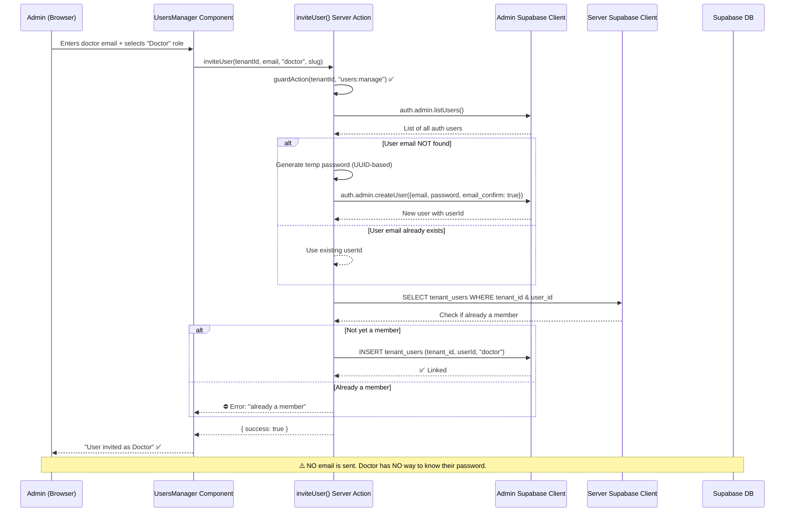

# Doctor Creation Flow — Complete Trace

## End-to-End Flow Diagram



---

## 1. Is an Auth User Created?

### ✅ Yes — But With Caveats

In [inviteUser()](file:///Users/maheskaliraj/Documents/MedFlow/medflow/src/lib/tenant/actions.ts#L179-L243), when the email doesn't already exist in Supabase Auth:

```typescript
// Line 203-208
const tempPassword = crypto.randomUUID().slice(0, 16) + 'Aa1!';
const { data: newUser, error: createError } = await adminClient.auth.admin.createUser({
  email: trimmedEmail,
  password: tempPassword,
  email_confirm: true,  // Auto-confirms email — no verification needed
});
```

| Aspect | Detail |
|--------|--------|
| Created via | `auth.admin.createUser()` (admin client, bypasses RLS) |
| Email confirmed? | **Yes** — `email_confirm: true` skips verification |
| Password | Random UUID-based string |
| User metadata | **None set** — no name, no role metadata stored on the auth user |

If the email **already exists** in Supabase Auth (e.g., registered at another clinic), the existing user's ID is reused — no new auth user is created.

---

## 2. Is an Invitation Email Sent?

### ⛔ No — This Is the Critical Gap

**No email of any kind is sent.** The code:
1. Creates the auth user silently
2. Generates a temp password that is **used only in the `createUser` call**
3. **Does NOT store, return, or send the temp password anywhere**
4. Shows the admin a success message: `"User {email} has been invited as Doctor"`

```typescript
// Line 203 — password is generated...
const tempPassword = crypto.randomUUID().slice(0, 16) + 'Aa1!';

// Line 204-208 — ...used to create the user...
await adminClient.auth.admin.createUser({ email, password: tempPassword, ... });

// ...and then the variable goes out of scope. GONE FOREVER.
```

> [!CAUTION]
> **The temp password is lost.** It's never returned to the calling code, never displayed to the admin, and never emailed to the doctor. The doctor has **no way to log in**.

The [UsersManager](file:///Users/maheskaliraj/Documents/MedFlow/medflow/src/components/admin/users-manager.tsx#L43-L58) component only shows a success toast — it doesn't display the password either:

```typescript
setSuccess(`User ${inviteEmail} has been invited as ${ROLE_LABELS[inviteRole]}`);
```

---

## 3. Is a Temporary Password Generated?

### ✅ Yes — But It's Immediately Discarded

```typescript
const tempPassword = crypto.randomUUID().slice(0, 16) + 'Aa1!';
// Example output: "a1b2c3d4-e5f6-789Aa1!"
```

| Property | Value |
|----------|-------|
| Format | First 16 chars of UUID + `Aa1!` suffix |
| Length | 20 characters |
| Strength | Strong (UUID randomness + mixed case + special char) |
| Stored? | ⛔ **No** — exists only in function scope |
| Returned to caller? | ⛔ **No** — `inviteUser()` returns `{ success: true }` |
| Displayed to admin? | ⛔ **No** |
| Emailed to doctor? | ⛔ **No** |

---

## 4. How Does the Doctor Log In?

### ⛔ They Can't — No Login Path Exists

The [login page](file:///Users/maheskaliraj/Documents/MedFlow/medflow/src/app/%28auth%29/login/page.tsx) requires email + password:

```typescript
const { error: signInError } = await supabase.auth.signInWithPassword({
  email,
  password,
});
```

But the doctor:
- ❌ Was never told their password
- ❌ Has no "forgot password" flow (none exists in the app)
- ❌ Has no magic-link login option
- ❌ Has no invitation email with a login link
- ❌ Cannot register themselves (registration creates a **new clinic**, not a user within an existing clinic)

**The doctor account is created but completely inaccessible.**

---

## 5. What Permissions Does the Doctor Receive?

### ✅ Well-Defined — If They Could Log In

When a doctor is added with role `doctor`, they receive these app-level permissions ([auth.ts](file:///Users/maheskaliraj/Documents/MedFlow/medflow/src/types/auth.ts#L39-L42)):

```typescript
doctor: [
  'queue:add',       // Add patients to queue
  'queue:call',      // Call next patient
  'queue:complete',  // Mark patient as done
  'queue:skip',      // Skip a patient
  'queue:recall',    // Re-queue a skipped patient
  'queue:transfer',  // Transfer patient to another dept
  'queue:cancel',    // Cancel a queue entry
  'queue:view',      // View queue data
],
```

And these RLS-level database permissions:

| Table | SELECT | INSERT | UPDATE | DELETE |
|-------|--------|--------|--------|--------|
| `tenants` | ✅ Own tenant | ❌ | ❌ | ❌ |
| `tenant_users` | ✅ Own tenant | ❌ | ❌ | ❌ |
| `departments` | ✅ Own tenant | ❌ | ❌ | ❌ |
| `counters` | ✅ Own tenant | ❌ | ❌ | ❌ |
| `queue_entries` | ✅ Own tenant | ✅ | ✅ | ❌ |
| `queue_audit_log` | ✅ Own tenant | ✅ | ❌ | ❌ |
| `token_sequences` | ✅ Own tenant | ✅ | ✅ | ✅ |
| `display_screens` | ✅ Own tenant | ❌ | ❌ | ❌ |

**What doctors CANNOT do:**
- ❌ Manage departments, counters, or display screens
- ❌ Manage users or invite staff
- ❌ Update tenant settings
- ❌ View analytics
- ❌ Access other clinics' data

---

## Summary of Issues

| # | Issue | Severity | Impact |
|---|-------|----------|--------|
| 1 | Temp password is never returned or displayed | 🔴 Critical | Doctor cannot log in at all |
| 2 | No invitation email sent | 🔴 Critical | Doctor doesn't know account was created |
| 3 | No "forgot password" / password reset flow | 🔴 Critical | No recovery path even if doctor knows their email |
| 4 | No magic-link / passwordless login option | 🟡 Medium | Alternative login method missing |
| 5 | `listUsers()` fetches ALL auth users to find one email | 🟡 Performance | Won't scale; should use `getUserByEmail()` or similar |

---

## Recommended Fixes

### Option A: Return Temp Password to Admin (Quick Fix)

Return the password so the admin can share it manually:

```diff
// In inviteUser() — return the temp password
+ let generatedPassword: string | undefined;

  if (existingUser) {
    userId = existingUser.id;
  } else {
    const tempPassword = crypto.randomUUID().slice(0, 16) + 'Aa1!';
+   generatedPassword = tempPassword;
    // ... create user ...
  }

  // ... link user ...

- return { success: true };
+ return { success: true, tempPassword: generatedPassword };
```

Then in UsersManager, display the password in the success message.

### Option B: Use Supabase Magic Link (Better UX)

Instead of creating with a password, use `inviteUserByEmail()`:

```typescript
const { data, error } = await adminClient.auth.admin.inviteUserByEmail(email);
```

This sends an email with a magic link. The doctor clicks the link, sets their password, and is logged in.

### Option C: Add Password Reset Flow (Most Complete)

1. Add a "Forgot Password" link on the login page
2. Call `supabase.auth.resetPasswordForEmail(email)` 
3. Supabase sends a password-reset email
4. Doctor sets their own password

This also serves as the invitation flow — admin tells doctor "an account was created, use forgot password to set up".
