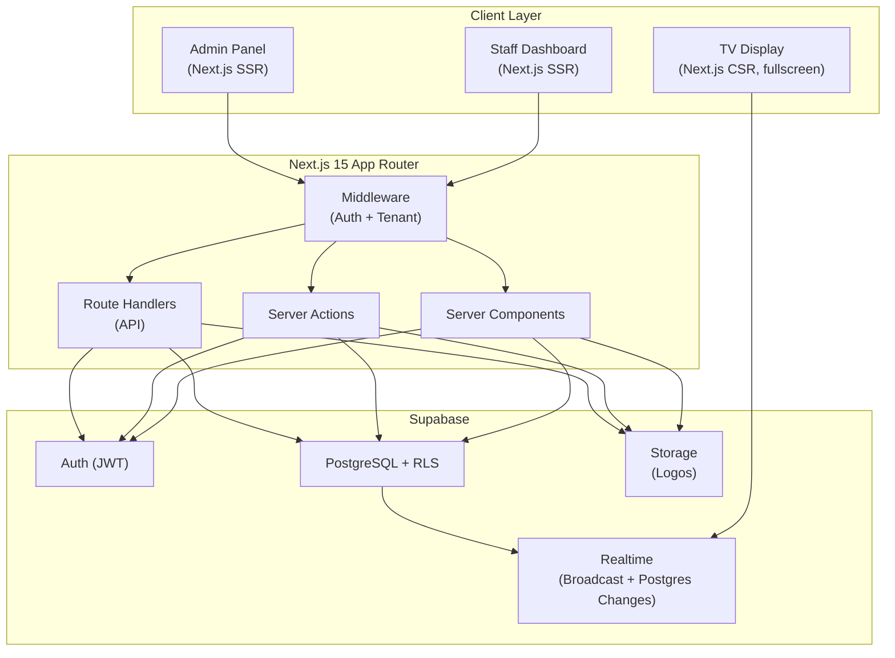
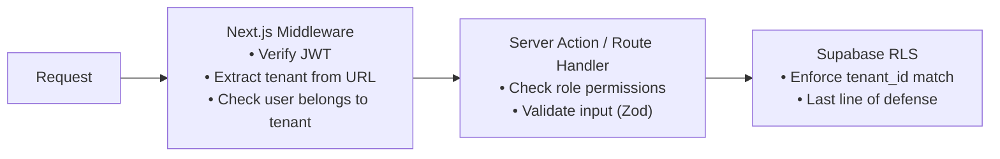

# MedFlow — Multi-Tenant Hospital Queue Management System

## Overview

MedFlow is a SaaS queue management system for small clinics. Each clinic is an isolated tenant. Staff manage patient queues in real time; patients and waiting rooms see live updates on a TV display screen.

**Stack**: Next.js 15 (App Router) · TypeScript · Supabase (Auth, DB, Realtime) · Tailwind CSS

**Explicitly excluded**: Notifications, Billing, EMR integration.

---

## 1. System Architecture



### Key Decisions

| Decision | Choice | Rationale |
|---|---|---|
| Multi-tenancy model | Shared DB + Row-Level Security | Cost-effective for small clinics; Supabase RLS enforces isolation |
| Realtime delivery | Supabase Realtime (Postgres Changes) | Native integration, no extra infra |
| TV Display auth | Short-lived signed URL token | No login needed; read-only channel subscription |
| Routing | Tenant via subdomain OR `/app/[tenantSlug]` | Start with slug-based; migrate to subdomain later |
| State management | React Server Components + `useOptimistic` | Minimal client JS; instant UI feedback |

---

## 2. Database Schema

### Tenants & Users

```sql
-- Each clinic is a tenant
CREATE TABLE tenants (
    id UUID PRIMARY KEY DEFAULT gen_random_uuid(),
    name TEXT NOT NULL,
    slug TEXT UNIQUE NOT NULL,  -- used in URL: /app/{slug}
    logo_url TEXT,
    settings JSONB DEFAULT '{}',  -- display prefs, queue behavior
    is_active BOOLEAN DEFAULT TRUE,
    created_at TIMESTAMPTZ DEFAULT now(),
    updated_at TIMESTAMPTZ DEFAULT now()
);

-- Links Supabase Auth users to tenants with roles
CREATE TABLE tenant_users (
    id UUID PRIMARY KEY DEFAULT gen_random_uuid(),
    tenant_id UUID REFERENCES tenants(id) ON DELETE CASCADE,
    user_id UUID REFERENCES auth.users(id) ON DELETE CASCADE,
    role TEXT NOT NULL CHECK (role IN ('super_admin','admin','doctor','receptionist','display')),
    is_active BOOLEAN DEFAULT TRUE,
    created_at TIMESTAMPTZ DEFAULT now(),
    UNIQUE(tenant_id, user_id)
);
```

### Queue System

```sql
-- Departments/counters within a clinic
CREATE TABLE departments (
    id UUID PRIMARY KEY DEFAULT gen_random_uuid(),
    tenant_id UUID REFERENCES tenants(id) ON DELETE CASCADE,
    name TEXT NOT NULL,           -- e.g. "General", "Dental"
    code TEXT NOT NULL,           -- e.g. "GEN", "DEN" (for token prefix)
    display_order INT DEFAULT 0,
    is_active BOOLEAN DEFAULT TRUE,
    created_at TIMESTAMPTZ DEFAULT now(),
    UNIQUE(tenant_id, code)
);

-- Individual service counters
CREATE TABLE counters (
    id UUID PRIMARY KEY DEFAULT gen_random_uuid(),
    tenant_id UUID REFERENCES tenants(id) ON DELETE CASCADE,
    department_id UUID REFERENCES departments(id) ON DELETE CASCADE,
    name TEXT NOT NULL,            -- e.g. "Counter 1"
    serving_doctor_id UUID REFERENCES tenant_users(id),
    is_active BOOLEAN DEFAULT TRUE,
    created_at TIMESTAMPTZ DEFAULT now()
);

-- Daily token sequence per department
CREATE TABLE token_sequences (
    id UUID PRIMARY KEY DEFAULT gen_random_uuid(),
    tenant_id UUID REFERENCES tenants(id) ON DELETE CASCADE,
    department_id UUID REFERENCES departments(id) ON DELETE CASCADE,
    date DATE NOT NULL DEFAULT CURRENT_DATE,
    last_number INT DEFAULT 0,
    UNIQUE(tenant_id, department_id, date)
);

-- Core queue entries
CREATE TABLE queue_entries (
    id UUID PRIMARY KEY DEFAULT gen_random_uuid(),
    tenant_id UUID REFERENCES tenants(id) ON DELETE CASCADE,
    department_id UUID REFERENCES departments(id),
    counter_id UUID REFERENCES counters(id),
    token_number TEXT NOT NULL,     -- e.g. "GEN-042"
    patient_name TEXT NOT NULL,
    patient_phone TEXT,
    status TEXT NOT NULL DEFAULT 'waiting'
        CHECK (status IN ('waiting','serving','completed','skipped','cancelled')),
    priority INT DEFAULT 0,        -- 0=normal, 1=priority, 2=emergency
    notes TEXT,
    called_at TIMESTAMPTZ,
    completed_at TIMESTAMPTZ,
    created_at TIMESTAMPTZ DEFAULT now(),
    updated_at TIMESTAMPTZ DEFAULT now()
);

-- Audit trail for queue state changes
CREATE TABLE queue_audit_log (
    id UUID PRIMARY KEY DEFAULT gen_random_uuid(),
    tenant_id UUID REFERENCES tenants(id) ON DELETE CASCADE,
    queue_entry_id UUID REFERENCES queue_entries(id) ON DELETE CASCADE,
    action TEXT NOT NULL,          -- 'created','called','completed','skipped','recalled','transferred'
    performed_by UUID REFERENCES auth.users(id),
    old_status TEXT,
    new_status TEXT,
    metadata JSONB DEFAULT '{}',
    created_at TIMESTAMPTZ DEFAULT now()
);
```

### Display Configuration

```sql
CREATE TABLE display_screens (
    id UUID PRIMARY KEY DEFAULT gen_random_uuid(),
    tenant_id UUID REFERENCES tenants(id) ON DELETE CASCADE,
    name TEXT NOT NULL,            -- e.g. "Lobby TV"
    access_token TEXT UNIQUE NOT NULL, -- short token for TV URL
    department_ids UUID[] DEFAULT '{}', -- which depts to show (empty = all)
    layout TEXT DEFAULT 'standard' CHECK (layout IN ('standard','compact','minimal')),
    is_active BOOLEAN DEFAULT TRUE,
    expires_at TIMESTAMPTZ,
    created_at TIMESTAMPTZ DEFAULT now()
);
```

### RLS Policy Summary

| Table | Policy | Rule |
|---|---|---|
| All tables | Tenant isolation | `tenant_id = (SELECT tenant_id FROM tenant_users WHERE user_id = auth.uid())` |
| `tenants` | Admin-only write | Only `admin` / `super_admin` can UPDATE |
| `queue_entries` | Staff write | `receptionist`, `doctor`, `admin` can INSERT/UPDATE |
| `display_screens` | Admin manage | Only `admin` can create/delete screens |
| `queue_entries` | Display read | Display token grants SELECT on filtered departments |

---

## 3. User Roles & Permissions (RBAC)

| Permission | Super Admin | Admin | Doctor | Receptionist | Display |
|---|:---:|:---:|:---:|:---:|:---:|
| Create/manage tenants | ✅ | — | — | — | — |
| Manage tenant settings | ✅ | ✅ | — | — | — |
| Manage users & roles | ✅ | ✅ | — | — | — |
| Manage departments | ✅ | ✅ | — | — | — |
| Manage counters | ✅ | ✅ | — | — | — |
| Manage display screens | ✅ | ✅ | — | — | — |
| Add patient to queue | ✅ | ✅ | ✅ | ✅ | — |
| Call next patient | ✅ | ✅ | ✅ | — | — |
| Skip/recall patient | ✅ | ✅ | ✅ | — | — |
| Complete/cancel visit | ✅ | ✅ | ✅ | — | — |
| Transfer patient | ✅ | ✅ | ✅ | — | — |
| View queue | ✅ | ✅ | ✅ | ✅ | ✅ (read-only) |
| View analytics | ✅ | ✅ | — | — | — |

### Role Details

- **Super Admin** — Platform operator. Manages all tenants. One per deployment.
- **Admin** — Clinic owner/manager. Full control within their tenant.
- **Doctor** — Assigned to a counter. Calls, serves, and completes patients.
- **Receptionist** — Front desk. Adds patients, prints tokens. Cannot call/serve.
- **Display** — Headless role for TV screens. Read-only realtime subscription.

---

## 4. Folder Structure

```
medflow/
├── src/
│   ├── app/
│   │   ├── (auth)/
│   │   │   ├── login/page.tsx
│   │   │   ├── register/page.tsx
│   │   │   └── layout.tsx
│   │   ├── (dashboard)/
│   │   │   ├── [tenantSlug]/
│   │   │   │   ├── layout.tsx              # tenant context provider
│   │   │   │   ├── page.tsx                # dashboard home
│   │   │   │   ├── queue/
│   │   │   │   │   ├── page.tsx            # live queue board
│   │   │   │   │   └── _components/
│   │   │   │   ├── counter/
│   │   │   │   │   └── [counterId]/page.tsx # doctor's counter view
│   │   │   │   ├── reception/
│   │   │   │   │   └── page.tsx            # receptionist add-patient
│   │   │   │   ├── departments/
│   │   │   │   │   └── page.tsx
│   │   │   │   ├── counters/
│   │   │   │   │   └── page.tsx
│   │   │   │   ├── users/
│   │   │   │   │   └── page.tsx
│   │   │   │   ├── display/
│   │   │   │   │   └── page.tsx            # manage display screens
│   │   │   │   ├── analytics/
│   │   │   │   │   └── page.tsx
│   │   │   │   └── settings/
│   │   │   │       └── page.tsx
│   │   │   └── layout.tsx                  # authenticated layout
│   │   ├── display/
│   │   │   └── [token]/page.tsx            # public TV display (no auth)
│   │   ├── api/
│   │   │   ├── queue/route.ts
│   │   │   ├── display/[token]/route.ts
│   │   │   └── webhooks/route.ts
│   │   ├── layout.tsx                      # root layout
│   │   ├── page.tsx                        # landing page
│   │   └── globals.css
│   ├── components/
│   │   ├── ui/                             # reusable primitives (shadcn/ui)
│   │   ├── queue/
│   │   │   ├── queue-board.tsx
│   │   │   ├── queue-entry-card.tsx
│   │   │   ├── add-patient-form.tsx
│   │   │   └── token-display.tsx
│   │   ├── display/
│   │   │   ├── tv-layout.tsx
│   │   │   ├── now-serving.tsx
│   │   │   └── waiting-list.tsx
│   │   ├── layout/
│   │   │   ├── sidebar.tsx
│   │   │   ├── header.tsx
│   │   │   └── tenant-switcher.tsx
│   │   └── providers/
│   │       ├── tenant-provider.tsx
│   │       ├── realtime-provider.tsx
│   │       └── auth-provider.tsx
│   ├── lib/
│   │   ├── supabase/
│   │   │   ├── client.ts                   # browser client
│   │   │   ├── server.ts                   # server client
│   │   │   ├── admin.ts                    # service-role client
│   │   │   └── middleware.ts               # auth middleware helper
│   │   ├── auth/
│   │   │   ├── permissions.ts              # RBAC logic
│   │   │   └── guards.ts                   # route protection
│   │   ├── queue/
│   │   │   ├── actions.ts                  # server actions
│   │   │   ├── queries.ts                  # data fetching
│   │   │   └── utils.ts                    # token generation, etc.
│   │   ├── tenant/
│   │   │   ├── actions.ts
│   │   │   └── queries.ts
│   │   └── utils/
│   │       ├── constants.ts
│   │       └── helpers.ts
│   ├── hooks/
│   │   ├── use-realtime-queue.ts
│   │   ├── use-tenant.ts
│   │   ├── use-permissions.ts
│   │   └── use-audio.ts                    # "ding" on patient call
│   ├── types/
│   │   ├── database.ts                     # generated from Supabase
│   │   ├── queue.ts
│   │   ├── tenant.ts
│   │   └── auth.ts
│   └── middleware.ts                       # Next.js middleware (auth + tenant)
├── supabase/
│   ├── migrations/
│   │   ├── 001_create_tenants.sql
│   │   ├── 002_create_departments.sql
│   │   ├── 003_create_queue.sql
│   │   ├── 004_create_display.sql
│   │   ├── 005_create_rls_policies.sql
│   │   └── 006_create_functions.sql
│   ├── seed.sql
│   └── config.toml
├── public/
│   ├── sounds/
│   │   └── ding.mp3
│   └── images/
├── tailwind.config.ts
├── next.config.ts
├── tsconfig.json
├── package.json
└── .env.local
```

---

## 5. API Design

### Server Actions (primary pattern for mutations)

| Action | File | Roles | Description |
|---|---|---|---|
| `addPatientToQueue` | `lib/queue/actions.ts` | admin, doctor, receptionist | Generate token, insert queue entry |
| `callNextPatient` | `lib/queue/actions.ts` | admin, doctor | Set status → `serving`, assign counter |
| `completePatient` | `lib/queue/actions.ts` | admin, doctor | Set status → `completed` |
| `skipPatient` | `lib/queue/actions.ts` | admin, doctor | Set status → `skipped` |
| `recallPatient` | `lib/queue/actions.ts` | admin, doctor | Set `skipped` → `waiting` (re-queue) |
| `transferPatient` | `lib/queue/actions.ts` | admin, doctor | Move to different department |
| `cancelEntry` | `lib/queue/actions.ts` | admin, doctor, receptionist | Set status → `cancelled` |

### Route Handlers (for display screens & external access)

```
GET  /api/display/[token]       → Validate display token, return current queue state
GET  /api/display/[token]/sse   → SSE stream for realtime (fallback if WS unavailable)
```

### Data Queries (Server Components)

| Query | Description |
|---|---|
| `getQueueByDepartment(tenantId, deptId, date)` | All entries for a dept today |
| `getActiveQueue(tenantId)` | All waiting + serving entries |
| `getCounterStatus(counterId)` | Current patient at a counter |
| `getDailyStats(tenantId, date)` | Wait times, throughput, etc. |
| `getTenantBySlug(slug)` | Tenant lookup for routing |

### Realtime Channels

| Channel | Event | Payload | Subscribers |
|---|---|---|---|
| `queue:{tenant_id}` | `postgres_changes` on `queue_entries` | Full row | Dashboard, TV Display |
| `counter:{counter_id}` | `broadcast` | `{ action, entry }` | Doctor's counter view |

---

## 6. Security Design

### Authentication

- **Supabase Auth** with email/password (primary) and magic link (optional).
- JWT stored in httpOnly cookie via `@supabase/ssr`.
- Session refresh handled by Next.js middleware on every request.

### Authorization Layers



**Three layers ensure defense-in-depth:**

1. **Middleware** — Redirects unauthenticated users. Verifies tenant membership.
2. **Application** — `withPermission(action, role)` wrapper validates RBAC before executing.
3. **Database** — RLS policies on every table. Even if app logic fails, data stays isolated.

### Tenant Isolation

- Every query is scoped by `tenant_id` via RLS.
- `tenant_id` is **never** taken from client input — always derived from the authenticated user's `tenant_users` record.
- Cross-tenant access is impossible at the DB level.

### Display Screen Security

- Display screens use a **random access token** (not user auth).
- Tokens are scoped to specific departments and have optional expiry.
- Grants **read-only** access to queue data for that tenant.
- No sensitive data (phone numbers, notes) is sent to display screens.

### Input Validation

- All Server Actions validate input with **Zod schemas**.
- Patient phone numbers are optional and stored hashed if provided.
- SQL injection is prevented by Supabase's parameterized queries.

### Rate Limiting

- Supabase built-in rate limiting on Auth endpoints.
- Custom rate limiting on queue mutations via middleware (e.g., max 5 entries/min per user).

---

## 7. Development Roadmap

### Phase 1 — Foundation (Week 1–2)

- [ ] Initialize Next.js 15 project with TypeScript + Tailwind
- [ ] Set up Supabase project (local dev with CLI)
- [ ] Create DB migrations (tenants, users, departments, counters)
- [ ] Implement Supabase Auth (login, register, session management)
- [ ] Build Next.js middleware (auth + tenant resolution)
- [ ] Create RBAC permission system
- [ ] Build authenticated layout shell (sidebar, header)

### Phase 2 — Queue Core (Week 3–4)

- [ ] Create queue_entries and token_sequences tables + RLS
- [ ] Implement token generation logic (dept-code + daily sequence)
- [ ] Build receptionist view — add patient to queue form
- [ ] Build queue board — live list of all entries by department
- [ ] Implement server actions: add, call, complete, skip, recall, transfer
- [ ] Add audit logging for all queue state changes
- [ ] Build doctor's counter view — current patient + call next

### Phase 3 — Realtime & Display (Week 5–6)

- [ ] Set up Supabase Realtime subscriptions for queue changes
- [ ] Build `useRealtimeQueue` hook for live updates
- [ ] Create TV display screen layout (now-serving + waiting list)
- [ ] Implement display token generation and validation
- [ ] Add audio "ding" on patient call events
- [ ] Build display management page (create/revoke screen tokens)
- [ ] Optimize display for large screens (responsive, auto-scroll)

### Phase 4 — Admin & Analytics (Week 7–8)

- [ ] Build tenant settings page (name, logo, queue preferences)
- [ ] Build user management page (invite, assign roles, deactivate)
- [ ] Build department and counter management pages
- [ ] Create analytics dashboard (avg wait time, patients served, peak hours)
- [ ] Add daily auto-reset for token sequences (cron or DB function)

### Phase 5 — Polish & Production (Week 9–10)

- [ ] Landing page with tenant registration flow
- [ ] Error boundaries and loading states
- [ ] Accessibility audit (ARIA labels, keyboard nav, color contrast)
- [ ] Performance optimization (React Server Components, caching)
- [ ] E2E tests (Playwright) for critical flows
- [ ] Deploy to Vercel + Supabase Cloud
- [ ] Set up monitoring (Vercel Analytics, Supabase Dashboard)

---

## Open Questions

> [!IMPORTANT]
> **Tenant Onboarding**: Should new clinics self-register, or is it admin-provisioned only?

> [!IMPORTANT]
> **URL Strategy**: Slug-based (`/app/clinic-name/queue`) vs subdomain-based (`clinic-name.medflow.app`)? Slug is simpler to start; subdomain feels more professional.

> [!IMPORTANT]
> **Tailwind Version**: You mentioned Tailwind — should I use **Tailwind v4** (latest) or **v3** with shadcn/ui components?

> [!NOTE]
> **Token Format**: Proposed format is `{DEPT_CODE}-{DAILY_SEQ}` (e.g., `GEN-042`). Any preference for a different format?

> [!NOTE]
> **Display Screen**: Should the TV display show a simple "Now Serving / Waiting" layout, or do you want a more complex multi-department grid view?
